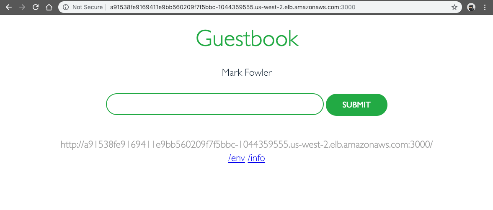

## Kick the Tires on the Guestbook Demo Application

If you want to just check out the guestbook application, kick it around here: http://a91538fe9169411e9bb560209f7f5bbc-1044359555.us-west-2.elb.amazonaws.com:3000/

If you want to walkthrough the Demo and build an Amazon EKS Cluster and Worker Nodes, continue on from here and follow each step carefully. Holler with any problems. I'm very much a newb on this Kubernetes technology, though ramping up quickly.

## Create EKS Cluster Service Role in IAM

To create your Amazon EKS service role in the IAM console:

1. Open the IAM console at https://console.aws.amazon.com/iam/.

2. Choose **Roles**, then **Create role**.

3. Choose **EKS** from the list of services, then **Allows Amazon EKS to manage your clusters on your behalf** for your use case, then **Next: Permissions**.

4. Choose **Next: Review**.

5. For **Role name**, enter a unique name for your role, such as `Stoic-EksCluster-ServiceRole`, then choose **Create role**.

## Create AWS EKS Cluster VPC Stack

To create the EKS Cluster VPC with defaults, use the following command.

```bash
aws cloudformation create-stack --profile=stoic \
    --stack-name "Stoic-EksCluster-Vpc-Stack" \
    --template-body https://amazon-eks.s3-us-west-2.amazonaws.com/cloudformation/2019-01-09/amazon-eks-vpc-sample.yaml
```

If you want to use values other then the defaults, check the CloudFormation template at the referenced URL for the parameters to work with. Note the following outputs generated from this command. These values will be used later in this demo.

```bash
aws cloudformation describe-stacks --profile=stoic \
    --stack-name "Stoic-EksCluster-Vpc-Stack" \
    --query "Stacks[].Outputs"

[
    [
        {
            "OutputKey": "SecurityGroups",
            "OutputValue": "sg-069a1b7585d2ec879",
            "Description": "Security group for the cluster control plane communication with worker nodes"
        },
        {
            "OutputKey": "VpcId",
            "OutputValue": "vpc-0ee2845a85eef4d1b",
            "Description": "The VPC Id"
        },
        {
            "OutputKey": "SubnetIds",
            "OutputValue": "subnet-048f7eb94d7433cfa,subnet-0deacae0efb648275,subnet-015c0bdab265cf8fa",
            "Description": "All subnets in the VPC"
        }
    ]
]
```

## Install kubectl for Amazon EKS

Kubernetes uses a command-line utility called kubectl for communicating with the cluster API server. Beginning with Kubernetes version 1.10, you can configure the kubectl client to work with Amazon EKS by installing the AWS IAM Authenticator for Kubernetes and modifying your kubectl configuration file to use it for authentication.

To install the `kubectl` tool, use these instructions: https://docs.aws.amazon.com/eks/latest/userguide/getting-started.html#get-started-kubectl

## Install the aws-iam-authenticator for Amazon EKS

Amazon EKS clusters require the [AWS IAM Authenticator for Kubernetes](https://github.com/kubernetes-sigs/aws-iam-authenticator) to allow IAM authentication for your Kubernetes cluster. Beginning with Kubernetes version 1.10, you can configure the `kubectl` client to work with Amazon EKS by installing the AWS IAM Authenticator for Kubernetes and modifying your `kubectl` configuration file to use it for authentication.

Follow the instructions here:
https://docs.aws.amazon.com/eks/latest/userguide/getting-started.html#get-started-kubectl

## Create Your Amazon EKS Cluster

In the Kubernetes Engine, a cluster consists of at least one cluster master and multiple worker machines called nodes. A cluster is the foundation of KE: the Kubernetes objects that represent your containerized applications all run on top of a cluster. With this basic understanding on the table, and the above commands completed, now you can create your Amazon EKS cluster. There are some subtleties related to the IAM User or Role that creates the cluster and the ability to make API calls to the EKS API server. Make sure you know what IAM User or Role you are using when creating the cluster.

Note that the `arn` used in the following command for creating your EKS cluster is the one tied to the service role created at the beginning of this demo. The `subnetIds` and `securityGroupIds` are the values you noted above when the `describe-stacks` command was run against your EKS Cluster VPC CloudFormation stack.

```bash
aws eks create-cluster --profile=stoic \
    --name "Stoic-EksCluster" \
    --role-arn "arn:aws:iam::750444023825:role/Stoic-EksCluster-ServiceRole" \
    --resources-vpc-config "subnetIds=subnet-048f7eb94d7433cfa,subnet-0deacae0efb648275,subnet-015c0bdab265cf8fa,securityGroupIds=sg-069a1b7585d2ec879"

{
    "cluster": {
        "name": "Stoic-EksCluster",
        "arn": "arn:aws:eks:us-west-2:750444023825:cluster/Stoic-EksCluster",
        "createdAt": 1547313824.194,
        "version": "1.11",
        "roleArn": "arn:aws:iam::750444023825:role/Stoic-EksCluster-ServiceRole",
        "resourcesVpcConfig": {
            "subnetIds": [
                "subnet-048f7eb94d7433cfa",
                "subnet-0deacae0efb648275",
                "subnet-015c0bdab265cf8fa"
            ],
            "securityGroupIds": [
                "sg-069a1b7585d2ec879"
            ],
            "vpcId": "vpc-0ee2845a85eef4d1b"
        },
        "status": "CREATING",
        "certificateAuthority": {},
        "platformVersion": "eks.1"
    }
}
```

If the above command is successful (if it fails, it's most likely related to the IAM User or Role used to execute command), then you should see output similar to the above. Cluster provisioning usually takes less than 10 minutes. You can query the status of your cluster with the following command.

```bash
aws eks describe-cluster --profile=stoic \
    --name "Stoic-EksCluster" \
    --query "cluster.status"
```

When your cluster status is **ACTIVE**, you can proceed. You can also omit the `--query` option to get a complete metadata listing of your EKS Cluster. A few other helpful commands to verify different aspects of your cluster are listed below:

```bash
## Describe master endpoint
aws eks describe-cluster --profile=stoic \
    --name "Stoic-EksCluster" \
    --query "cluster.endpoint"

## Describe master certificate data
aws eks describe-cluster --profile=stoic \
    --name "Stoic-EksCluster" \
    --query "cluster.certificateAuthority.data"
```

## Configure kubectl for Amazon EKS

First, make sure you have `kubectl` installed. Use these instructions for your OS platform:

Now it's time to create your `kubeconfig` file for the EKS cluster you just built. Use the AWS CLI `update-kubeconfig` command to create or update your kubeconfig for your cluster. By default, the resulting configuration file is created at the default kubeconfig path (`.kube/config`) in your home directory or merged with an existing kubeconfig at that location. You can specify another path with the `--kubeconfig` option, which we'll do in the following command.

```bash
aws eks update-kubeconfig --profile=stoic \
    --name "Stoic-EksCluster" \
    --kubeconfig "~/.kube/config-Stoic-EksCluster"

Updated context arn:aws:eks:us-west-2:750444023825:cluster/Stoic-EksCluster in /Users/mlfowler/.kube/config-Stoic-EksCluster
```

Once you see a message about adding/updating a new context, then it's almost time to test your configuration that was just created.

We're going to make one modification before we move on. Most users are going to be using multiple AWS profiles when interacting with the CLI. To accommodate this scenario, open up the `~/.kube/config-Stoic-EksCluster` file and add the following to the `users` section of the config file, right below the `command: aws-iam-authenticator` line. This will tell `kubectl` to use the AWS profile and credentials that the EKS Cluster was created with.

```bash
env:
- name: AWS_PROFILE
  value: stoic
```

We're also going to make one more modification to our `KUBECONFIG` environment variable to accommodate multiple Kubernetes cluster configurations on your local machine. If you've worked with Kubernetes before, you may have an environment variable named `KUBECONFIG`. If so, save the current value of your `KUBECONFIG` environment variable, so you can restore it later. For example, on Linux:

```bash
export KUBECONFIG_SAVED=$KUBECONFIG
```

The `KUBECONFIG` environment variable is a list of paths to configuration files. The list is colon-delimited for Linux and Mac, and semicolon-delimited for Windows. If you do have a `KUBECONFIG` environment variable, familiarize yourself with the configuration files in the list.

If you have a `$HOME/.kube/config-Stoic-EksCluster` file like we created in this demo, and it's not already listed in your `KUBECONFIG` environment variable, append it to your `KUBECONFIG` environment variable now. For example, on Linux:

```bash
export KUBECONFIG=$KUBECONFIG:~/.kube/config-Stoic-EksCluster
```

If you find that you want to restore your configuration to the previous value, return your `KUBECONFIG` environment variable to its original value like this:

```bash
export KUBECONFIG=$KUBECONFIG_SAVED
```

Also, as you get going with `kubectl` you're going to want to remember a few commands. Bookark this URL for quick reference: https://kubernetes.io/docs/reference/kubectl/cheatsheet/. One small tip to prevent insanity is to run your commands with verbose logging (`--v=10`) enabled.

```bash
kubectl get svc --v=10

NAME         TYPE        CLUSTER-IP   EXTERNAL-IP   PORT(S)   AGE
kubernetes   ClusterIP   10.100.0.1   <none>        443/TCP   5m
```

If everything checks out, you should end up with output like the above. To verify a bit more information on your EKS Cluster, use the following command:

```bash
kubectl --kubeconfig ~/.kube/config-Stoic-EksCluster cluster-info

Kubernetes master is running at https://4A530A73F1AA2BF4009798217CDB7B69.yl4.us-west-2.eks.amazonaws.com
CoreDNS is running at https://4A530A73F1AA2BF4009798217CDB7B69.yl4.us-west-2.eks.amazonaws.com/api/v1/namespaces/kube-system/services/kube-dns:dns/proxy

To further debug and diagnose cluster problems, use 'kubectl cluster-info dump'.
```

## Launch and Configure Amazon EKS Worker Nodes

Now that your VPC and Kubernetes control plane are created, you can launch and configure your worker nodes. Likely enough time has passed, but you need to wait for your cluster status to show as ACTIVE. If you launch your worker nodes before the cluster is active, the worker nodes will fail to register with the cluster and you will have to relaunch them.

Launch the CloudFormation Stack for the worker nodes with this command:

```bash
aws cloudformation create-stack --profile=stoic \
    --stack-name "Stoic-EksCluster-WorkerNodes-Stack" \
    --capabilities CAPABILITY_IAM \
    --template-body https://amazon-eks.s3-us-west-2.amazonaws.com/cloudformation/2019-01-09/amazon-eks-nodegroup.yaml \
    --parameters ParameterKey=ClusterName,ParameterValue=Stoic-EksCluster \
    ParameterKey=ClusterControlPlaneSecurityGroup,ParameterValue=sg-069a1b7585d2ec879 \
    ParameterKey=NodeGroupName,ParameterValue=Stoic-EksCluster-WorkerNodes-Group \
    ParameterKey=NodeAutoScalingGroupMinSize,ParameterValue=1 \
    ParameterKey=NodeAutoScalingGroupMaxSize,ParameterValue=4 \
    ParameterKey=NodeInstanceType,ParameterValue=t2.small \
    ParameterKey=NodeImageId,ParameterValue=ami-0a2abab4107669c1b \
    ParameterKey=KeyName,ParameterValue=Stoic-EksCluster-WorkerNodes-KeyPair-001 \
    ParameterKey=VpcId,ParameterValue=vpc-0ee2845a85eef4d1b \
    ParameterKey=Subnets,ParameterValue=\"subnet-048f7eb94d7433cfa,subnet-0deacae0efb648275,subnet-015c0bdab265cf8fa\"
```

Note the following outputs generated from this command. These values will be used later in this demo.

```bash
aws cloudformation describe-stacks --profile=stoic \
    --stack-name "Stoic-EksCluster-WorkerNodes-Stack" \
    --query "Stacks[].Outputs"

[
    [
        {
            "OutputKey": "NodeInstanceRole",
            "OutputValue": "arn:aws:iam::750444023825:role/Stoic-EksCluster-WorkerNodes-Stac-NodeInstanceRole-1LNSVW11HNA8Z",
            "Description": "The node instance role"
        },
        {
            "OutputKey": "NodeSecurityGroup",
            "OutputValue": "sg-00d7e7bd57570de90",
            "Description": "The security group for the node group"
        }
    ]
]
```

## Enable Worker Nodes to Join EKS Cluster

We've got to do one thing to allow our new worker nodes to join the EKS Cluster we created. That means we need to download, edit, and apply the AWS authenticator configuration map.

1. Download the configuration map.

    ```bash
    curl -O https://amazon-eks.s3-us-west-2.amazonaws.com/cloudformation/2019-01-09/aws-auth-cm.yaml
    ```

2. Open the file with your favorite text editor. Replace the `rolearn` value with the `NodeInstanceRole` value that you recorded in the previous CloudFormation Stack creation procedure, and save the file.

    ```bash
    apiVersion: v1
    kind: ConfigMap
    metadata:
    name: aws-auth
    namespace: kube-system
    data:
    mapRoles: |
        - rolearn: arn:aws:iam::750444023825:role/Stoic-EksCluster-WorkerNodes-Stac-NodeInstanceRole-1LNSVW11HNA8Z
        username: system:node:{{EC2PrivateDNSName}}
        groups:
            - system:bootstrappers
            - system:nodes
    ```

3. Apply the configuration. This command may take a few minutes to finish.

    ```bash
    kubectl apply -f aws-auth-cm.yaml
    ```

4. Now we just need to watch the status of your nodes and wait for them to reach the `Ready` status.

    ```bash
    kubectl get nodes --watch

    NAME                                            STATUS   ROLES    AGE   VERSION
    ip-192-168-179-111.us-west-2.compute.internal   Ready    <none>   24s   v1.11.5
    ip-192-168-196-159.us-west-2.compute.internal   Ready    <none>   29s   v1.11.5
    ip-192-168-71-167.us-west-2.compute.internal    Ready    <none>   24s   v1.11.5
    ip-192-168-196-159.us-west-2.compute.internal   Ready   <none>   31s   v1.11.5
    ip-192-168-179-111.us-west-2.compute.internal   Ready   <none>   30s   v1.11.5
    ip-192-168-71-167.us-west-2.compute.internal   Ready   <none>   30s   v1.11.5
    ip-192-168-196-159.us-west-2.compute.internal   Ready   <none>   41s   v1.11.5
    ip-192-168-179-111.us-west-2.compute.internal   Ready   <none>   40s   v1.11.5
    ip-192-168-71-167.us-west-2.compute.internal   Ready   <none>   41s   v1.11.5
    ```

When you see output like the above scrolling output then you're ready to move on to getting controllers and services deployed to your cluster.

## Launching a Guest Book Application

Now that all our resources are created, we're ready to actually do something with them. Even though we have a fully functioning and managed Amazon EKS Cluster and Worker Nodes, they're not doing anything other than incurring costs in your AWS account. For this demo, we're going to be using the sample Kubernetes guest book application right from the [Kubernetes Guest Book Application](https://github.com/kubernetes/examples/blob/master/guestbook-go/README.md) documentation.

After all is said and done, we're going to have a Redis Master/Slave Replication Controller, a Redis Master/Slave Service, a Guestbook Replication Controller, and a Guestbook Service running on our EKS Cluster. Use the commands below to accomplish this.

1. Create the Redis master replication controller.

    ```bash
    kubectl apply -f https://raw.githubusercontent.com/kubernetes/examples/master/guestbook-go/redis-master-controller.json
    ```

2. Create the Redis master service.

    ```bash
    kubectl apply -f https://raw.githubusercontent.com/kubernetes/examples/master/guestbook-go/redis-master-service.json
    ```

3. Create the Redis slave replication controller.

    ```bash
    kubectl apply -f https://raw.githubusercontent.com/kubernetes/examples/master/guestbook-go/redis-slave-controller.json
    ```

4. Create the Redis slave service.

    ```bash
    kubectl apply -f https://raw.githubusercontent.com/kubernetes/examples/master/guestbook-go/redis-slave-service.json
    ```

5. Create the guestbook replication controller.

    ```bash
    kubectl apply -f https://raw.githubusercontent.com/kubernetes/examples/master/guestbook-go/guestbook-controller.json
    ```

6. Create the guestbook service.

    ```bash
    kubectl apply -f https://raw.githubusercontent.com/kubernetes/examples/master/guestbook-go/guestbook-service.json
    ```

7. Now it's time to query the services in your cluster and wait until the `External IP` column for the guestbook service is populated. It may take several minutes before the IP address is available.

    ```bash
    kubectl get services -o wide

    NAME           TYPE           CLUSTER-IP      EXTERNAL-IP                                                               PORT(S)          AGE   SELECTOR
    guestbook      LoadBalancer   10.100.94.8     a91538fe9169411e9bb560209f7f5bbc-1044359555.us-west-2.elb.amazonaws.com   3000:30680/TCP   8s    app=guestbook
    kubernetes     ClusterIP      10.100.0.1      <none>                                                                    443/TCP          33m   <none>
    redis-master   ClusterIP      10.100.13.235   <none>                                                                    6379/TCP         46s   app=redis,role=master
    redis-slave    ClusterIP      10.100.134.76   <none>                                                                    6379/TCP         32s   app=redis,role=slave
    ```

After your external IP address is available, point a web browser to that address at port `3000` to view your guest book. Note that it may take several minutes for DNS to propagate and for your guest book to show up. If everything is working properly, you should see something similar in your browser to the screenshot below.



## Cleaning Up the Guestbook Demo Application

When you are finished experimenting with your guest book application, you should clean up the resources that you created for it. The following command deletes all of the services and replication controllers for the guest book application:

```bash
kubectl delete rc/redis-master rc/redis-slave rc/guestbook svc/redis-master svc/redis-slave svc/guestbook
```

When you are done with your Amazon EKS cluster, you should delete it and its resources so that you do not incur additional charges. Be warned that the EKS Cluster and Worker Nodes will rack up some costs pretty quickly if left unchecked.